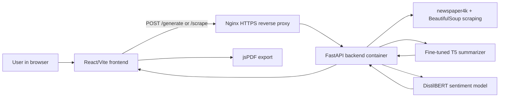

# NewsScribe Project Overview

## What the Project Is

NewsScribe is a full-stack AI news summarization application. It accepts either pasted article text or a URL to a news article, extracts article content when needed, generates a short abstractive summary with a fine-tuned T5 model, estimates sentiment with a DistilBERT SST-2 classifier, and displays the result in a React frontend with PDF export.

The project has three major parts:

| Area | Location | Purpose |
|---|---|---|
| Frontend | [`frontend/src/App.jsx`](../frontend/src/App.jsx) | Browser UI for text/URL input, API calls, result display, clipboard copy, and PDF export. |
| Backend | [`backend/main.py`](../backend/main.py) | FastAPI service for health checks, article scraping, model inference, metadata generation, and error handling. |
| Model training | [`notebooks/headline_gen.ipynb`](../notebooks/headline_gen.ipynb) | Colab notebook that fine-tunes T5-small on CNN/DailyMail and saves model artifacts. |

The production README identifies the public deployment as:

| Surface | URL |
|---|---|
| Frontend | `https://newsscribe.saieshsharma.me` |
| Backend API | `https://api.saieshsharma.me` |

## Why It Exists

The project exists to turn long-form news material into a compact, readable summary while preserving enough operational metadata to make the result inspectable. The frontend is deliberately simple: the user should paste either text or a link and receive a generated summary with latency, sentiment, and hardware metadata.

The engineering problem is not only "call a model." It also includes:

| Problem | Project Response |
|---|---|
| News pages vary wildly in HTML structure. | Use `newspaper4k` first, then fall back to BeautifulSoup paragraph extraction. |
| Transformer inference is expensive on small CPU hosts. | Run on CPU, cap PyTorch threads, truncate inputs, disable beam search, and use compact generation settings. |
| Browser-to-backend calls can fail because of CORS/mixed content. | Production puts the backend behind HTTPS via Nginx and allows CORS in FastAPI. |
| Model files are large. | `.gitignore` excludes model directories; deployment mounts them as host volumes. |
| Deployment should be repeatable. | GitHub Actions builds/pushes Docker image and swaps the EC2 container over SSH. |

## High-Level Architecture

## End-to-End Workflow

1. The user enters either article text or a URL in the textarea rendered by [`frontend/src/App.jsx`](../frontend/src/App.jsx).
2. The frontend determines whether the input starts with `http://` or `https://`.
3. URL input is sent to `POST /scrape`; plain text is sent to `POST /generate`.
4. The backend validates the request with Pydantic models in [`backend/main.py`](../backend/main.py).
5. For URL input, the backend downloads and parses the page with `newspaper4k`.
6. If extraction looks short or junk-like, the backend cleans HTML with BeautifulSoup and rebuilds article text from valid paragraphs.
7. The backend sends article text through `run_pipeline_inference`.
8. `run_pipeline_inference` computes sentiment over a truncated 384-character window and generates a summary from a T5 input window capped at 320 tokens.
9. The backend returns `summary` plus `metadata` containing latency, input token count, device, sentiment label, and sentiment score.
10. The frontend renders the summary, metadata footer, copy action, and PDF export button.

## Main Challenges Solved

| Challenge | Evidence | Solution |
|---|---|---|
| Article extraction from unpredictable layouts | `/scrape` code path in [`backend/main.py`](../backend/main.py) | Primary parser plus fallback paragraph sweep. |
| CPU inference latency | Git history around `451e801`, `7656efb`, and current generation settings | Single PyTorch thread, greedy decoding, shorter windows. |
| Tokenizer/model compatibility | Git history shows multiple tokenizer fixes | Current backend loads the T5 tokenizer from `google-t5/t5-base` and weights from `/app/model_weights`. |
| NLTK runtime errors in containers | [`backend/Dockerfile`](../backend/Dockerfile) | Bake `punkt` and `punkt_tab` into `/app/nltk_data`. |
| Large model artifacts in deployment | [`.gitignore`](../.gitignore), [`deploy.yml`](../.github/workflows/deploy.yml) | Exclude weights from git and mount model volumes on EC2. |

## Current Maturity

The project is a deployed MVP with production hardening around backend container deployment, Nginx reverse proxying, HTTPS, rate limiting, model volume mounting, and restart policy. It is not yet a large multi-user platform: there is no database, authentication, request queue, observability stack, or multi-replica model serving layer in this repository.

Current maturity by area:

| Area | Maturity | Notes |
|---|---|---|
| Frontend UX | MVP plus polish | Single-page flow, PDF export, loading/error states. |
| Backend API | Functional MVP | Small API surface, synchronous inference, broad CORS. |
| AI model | Custom trained summarizer plus off-the-shelf sentiment model | Training notebook exists; no reproducible training pipeline outside Colab. |
| Deployment | Practical single-host production | DockerHub + EC2 + SSH deployment; no rollback automation beyond replacing the container. |
| Operations | Basic | Nginx and Docker restart policies; no structured metrics/logging in repo. |

## Important Constraints

| Constraint | Why It Matters |
|---|---|
| CPU-only inference in current backend (`device = "cpu"`) | Generation must be latency-conscious; settings favor speed over best possible quality. |
| Synchronous request handling | A slow scrape or model run occupies the request path until completion. |
| No database | The app does not persist users, summaries, request history, or model feedback. |
| Model weights excluded from git | A clone of the repo is not enough to run production inference until weights are supplied. |
| Broad CORS policy | Convenient for development, but should be tightened for production. |
| URL scraping can fail | Paywalls, anti-bot pages, dynamic rendering, and malformed HTML can still defeat extraction. |

