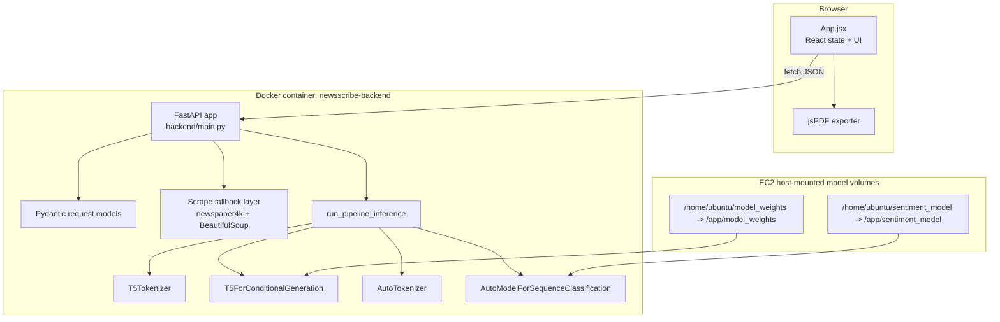
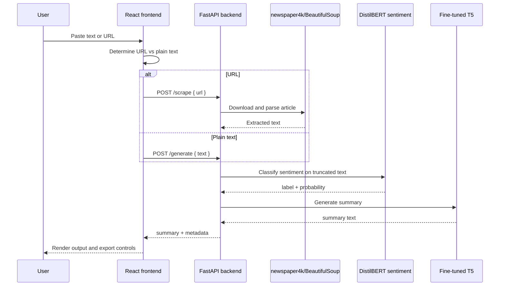
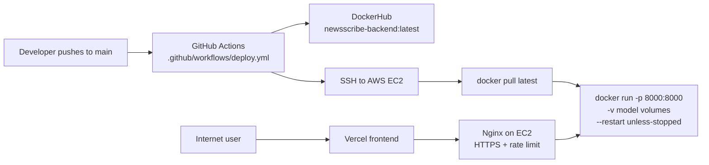
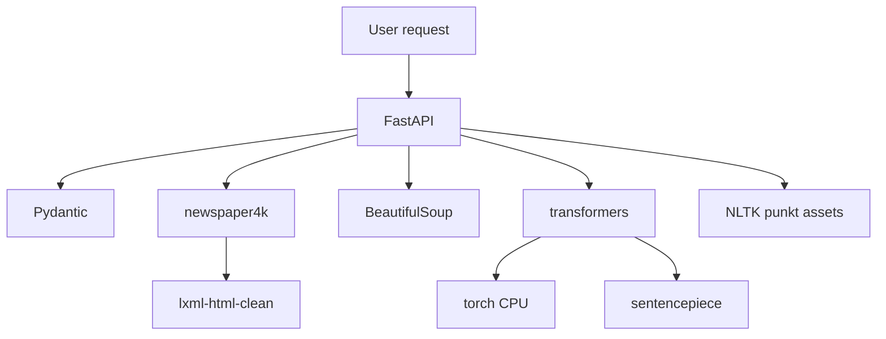

# Architecture

## Architecture Goal

NewsScribe is shaped around one primary goal: take unstructured news text or a news URL and return a concise generated summary quickly enough to feel interactive. Every component exists to support one of four responsibilities:

| Responsibility | Component |
|---|---|
| Collect user input and display output | React/Vite frontend |
| Validate requests and coordinate inference | FastAPI backend |
| Extract article text from URLs | `newspaper4k` and BeautifulSoup |
| Generate AI outputs | Fine-tuned T5 summarizer and DistilBERT sentiment classifier |

## Component Diagram

## Request Sequence

## Deployment Diagram

## Why Each Component Exists

| Component | Why It Exists | Relevant Files |
|---|---|---|
| React | Provides a responsive single-page UI and local state for input/result/loading/error. | [`frontend/src/App.jsx`](../frontend/src/App.jsx) |
| Vite | Fast frontend dev server and production bundler for React. | [`frontend/vite.config.js`](../frontend/vite.config.js) |
| Tailwind CSS v4 | Utility-first styling with custom theme variables. | [`frontend/src/index.css`](../frontend/src/index.css) |
| jsPDF | Creates a local PDF report in the browser without backend storage. | [`frontend/src/App.jsx`](../frontend/src/App.jsx) |
| FastAPI | Lightweight Python HTTP API with async route handlers and Pydantic validation. | [`backend/main.py`](../backend/main.py) |
| Pydantic | Defines request schemas for article text and URL payloads. | [`backend/main.py`](../backend/main.py) |
| newspaper4k | Attempts semantic news article extraction from a URL. | [`backend/main.py`](../backend/main.py) |
| BeautifulSoup | Fallback parser when newspaper extraction looks short or polluted. | [`backend/main.py`](../backend/main.py) |
| PyTorch | Runs transformer models on CPU. | [`backend/requirements.txt`](../backend/requirements.txt) |
| HuggingFace Transformers | Loads tokenizers/models and performs T5 generation/sentiment classification. | [`backend/main.py`](../backend/main.py) |
| Docker | Packages backend runtime dependencies reproducibly. | [`backend/Dockerfile`](../backend/Dockerfile) |
| GitHub Actions | Builds/pushes backend image and redeploys EC2 container. | [`.github/workflows/deploy.yml`](../.github/workflows/deploy.yml) |
| Nginx | Production reverse proxy, TLS termination, and rate limiting, described in README. | [`README.md`](../README.md) |

## Tradeoffs and Rejected Alternatives

The repository does not contain explicit ADR files, so the following rationale is inferred from code and commit history.

| Decision | Likely Alternatives | Why Current Choice Fits | Tradeoff |
|---|---|---|---|
| Single FastAPI backend | Flask, Django, Node/Express | FastAPI is concise, typed, and common for Python ML services. | Synchronous model work still blocks request handling unless scaled separately. |
| CPU deployment | GPU VM, hosted inference endpoint | CPU EC2 is cheaper and simpler. | Requires aggressive inference optimizations; quality/speed tradeoffs are visible. |
| Local model volumes | Bake weights into image, download from Hub on boot | Host volumes keep Docker image smaller and avoid repeated weight downloads. | Server must be provisioned with correct files before deploy. |
| Greedy decoding (`num_beams=1`) | Beam search, sampling | Faster and less CPU-intensive. | May produce less polished summaries than beam search. |
| No database | Postgres, MongoDB, Redis | App does not need persistence for MVP workflow. | No history, analytics, users, caching, or feedback loop. |
| GitHub Actions SSH deploy | Terraform, Kubernetes, ECS | Simple and enough for one EC2 host. | Harder to roll back, scale, or audit than managed deployments. |

## Dependency Map

