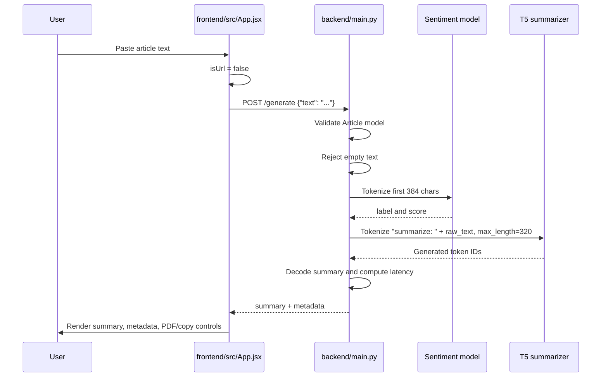
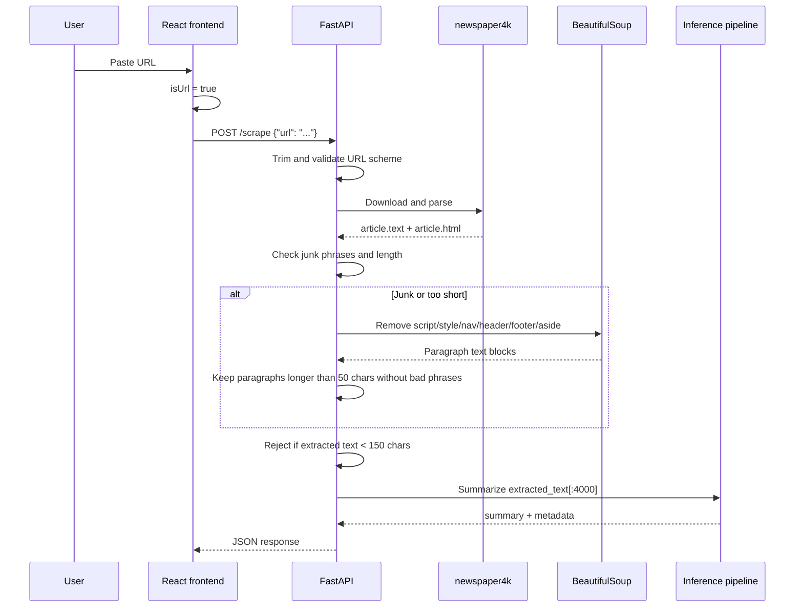

# Data Flow

## Text Input Flow

## URL Input Flow

## Backend Data Objects

| Object | Defined In | Fields | Purpose |
|---|---|---|---|
| `Article` | [`backend/main.py`](../backend/main.py) | `text: str` | Request model for direct text summarization. |
| `ScrapeRequest` | [`backend/main.py`](../backend/main.py) | `url: str` | Request model for URL scraping and summarization. |
| Inference response | [`backend/main.py`](../backend/main.py) | `summary`, `metadata` | Unified response shape for both endpoints. |
| Metadata | [`backend/main.py`](../backend/main.py) | `latency_ms`, `input_tokens`, `device`, `sentiment`, `score` | Operational and model side-channel details shown in frontend. |

## Important Transformations

| Step | Input | Transformation | Output |
|---|---|---|---|
| URL detection | User textarea string | `startsWith("http://") || startsWith("https://")` | Endpoint choice |
| URL validation | JSON URL | Trim and require HTTP/HTTPS prefix | Accepted target URL or 400 |
| Article parsing | URL | `newspaper4k` download/parse | Candidate article text |
| Fallback parsing | HTML | Remove layout tags, collect valid paragraphs | Better article body |
| Sentiment truncation | Raw text | First 384 characters, tokenizer max 384 | DistilBERT inputs |
| T5 prompt | Raw text | Prefix with `summarize:`, max 320 tokens | T5 input IDs |
| Decoding | Generated IDs | `tokenizer.decode(..., skip_special_tokens=True)` | Summary string |
| PDF export | Browser result object | jsPDF text and metadata rendering | Local PDF file |

## Error Flow

| Failure | Location | User-Facing Result |
|---|---|---|
| Empty direct text | `/generate` | HTTP 400 `Empty text stream.` |
| URL missing HTTP/HTTPS | `/scrape` | HTTP 400 `Invalid URI.` |
| Extracted text too short | `/scrape` | HTTP 400 `Unable to safely parse main news body from this layout.` |
| Unexpected scraping/inference exception | `/scrape` catch block | HTTP 500 with exception string |
| Network/API error in browser | `handleSummarize` catch | Error panel in UI |

## Data That Is Not Stored

NewsScribe currently does not persist:

| Data | Reason |
|---|---|
| User accounts | No authentication system exists. |
| Article URLs or text | No database or file logging in repo. |
| Generated summaries | Rendered in browser only. |
| Sentiment history | Returned per request only. |
| Feedback labels | No feedback UI or backend endpoint. |

