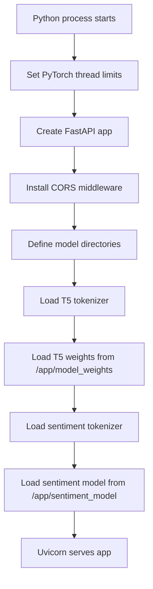
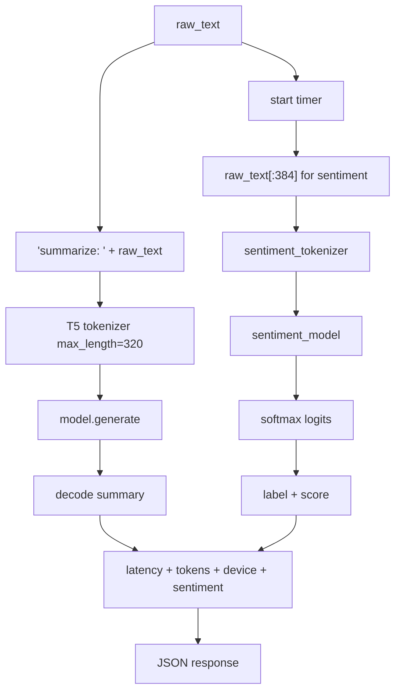

# Backend

## Backend Purpose

The backend is the ML and scraping engine. It owns request validation, URL extraction, transformer inference, latency measurement, and JSON responses. All backend application logic currently lives in [`backend/main.py`](../backend/main.py).

## Startup Lifecycle



Important startup behavior:

| Behavior | Detail |
|---|---|
| Thread throttling | `torch.set_num_threads(1)` and `torch.set_num_interop_threads(1)` reduce CPU contention on small EC2 instances. |
| NLTK path | `nltk.data.path = ["/app/nltk_data"]` forces container-baked assets. |
| Device | `device = "cpu"` is hard-coded. |
| T5 tokenizer | Loaded from `google-t5/t5-base`, while model weights load from `/app/model_weights`. |
| Sentiment model | Tokenizer and model load from `/app/sentiment_model`. |

## Controllers / Routes

| Route | Method | Function | Purpose |
|---|---|---|---|
| `/` | GET | `root` | Health response: `{"status": "healthy"}`. |
| `/generate` | POST | `generate_summary` | Validate direct text and summarize it. |
| `/scrape` | POST | `scrape_and_summarize` | Validate URL, extract article text, summarize it. |

## Request Models

| Model | Fields | Used By |
|---|---|---|
| `Article` | `text: str` | `/generate` |
| `ScrapeRequest` | `url: str` | `/scrape` |

These are Pydantic models. They validate the JSON shape before route logic runs. Semantic validation still happens manually, such as rejecting blank text or invalid URL schemes.

## Business Logic

### `run_pipeline_inference(raw_text: str)`

This is the central inference service function.



Generation settings:

| Setting | Value | Effect |
|---|---|---|
| `num_beams` | `1` | Greedy decoding, faster than beam search. |
| `max_new_tokens` | `70` | Caps response length. |
| `min_new_tokens` | `20` | Avoids extremely short outputs. |
| `no_repeat_ngram_size` | `3` | Reduces repeated 3-gram loops. |
| `length_penalty` | `1.0` | Neutral length adjustment. |
| `use_cache` | `True` | Reuses decoder key/value states during generation. |

## Scraping Logic

The `/scrape` route:

1. Trims the URL.
2. Requires `http://` or `https://`.
3. Creates a `NewsConfig`.
4. Sets a browser-like user agent.
5. Sets `request_timeout = 15`.
6. Downloads and parses with `NewsArticle`.
7. Checks extracted text for known junk phrases or insufficient length.
8. If needed, parses raw HTML with BeautifulSoup.
9. Removes non-content tags.
10. Keeps paragraph text blocks longer than 50 characters and not containing bad phrases.
11. Rejects if final extracted text is shorter than 150 characters.
12. Summarizes the first 4000 characters.

## Dependencies

| Dependency | Role |
|---|---|
| `fastapi` | API framework. |
| `uvicorn[standard]` | ASGI server. |
| `pydantic` | Request validation. |
| `torch` | Model execution. |
| `transformers` | Tokenizer/model loading and generation. |
| `sentencepiece` | T5 tokenizer support. |
| `newspaper4k` | Article extraction. |
| `beautifulsoup4` | HTML fallback parsing. |
| `nltk` | Required by article extraction stack. |
| `numpy` | ML numeric dependency, pinned to 1.26.4. |

## Known Backend Limitations

| Limitation | Impact |
|---|---|
| Single `main.py` module | Easy to read now, but controllers/services are not separated. |
| Hard-coded CPU | Cannot use GPU without code changes. |
| Broad exception handling in `/scrape` | Converts all unexpected errors to HTTP 500 with raw message. |
| Broad CORS | Convenient but permissive. |
| No response model | Response shape is implicit rather than enforced by FastAPI schema. |
| No timeout around model generation | Very slow inputs can occupy request handling until complete. |

## Useful Local Commands

```bash
cd backend
python -m venv venv
pip install -r requirements.txt
uvicorn main:app --reload
```

Docker:

```bash
cd backend
docker build -t newsscribe-backend .
docker run -d --name newsscribe-backend --restart unless-stopped -p 8000:8000 newsscribe-backend
```

