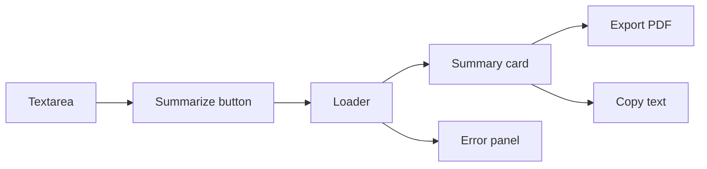

# Frontend

## Frontend Purpose

The frontend is a single-page React app that lets a user submit news text or a news URL, calls the backend, presents the generated summary and metadata, and exports the result to a PDF. The main implementation is [`frontend/src/App.jsx`](../frontend/src/App.jsx).

## Routing

There is no client-side router. The app has one screen and one primary workflow. This is appropriate for the current MVP because the user journey is linear:



## State Management

The app uses React `useState` directly:

| State | Type | Purpose |
|---|---|---|
| `text` | string | The textarea contents. |
| `result` | object/null | Backend response containing `summary` and `metadata`. |
| `loading` | boolean | Controls disabled button state and loader rendering. |
| `errorMsg` | string/null | Stores user-visible errors from failed requests. |

This is enough because state is local to one component tree. There is no Redux, Zustand, Context API, or server-state library.

## API Selection

The frontend reads the backend base URL from:

```js
const API_URL = import.meta.env.VITE_API_URL || "http://127.0.0.1:8001";
```

It chooses the endpoint by checking whether input starts with `http://` or `https://`.

| Input | Endpoint | Body |
|---|---|---|
| URL | `POST /scrape` | `{ "url": text.trim() }` |
| Plain text | `POST /generate` | `{ "text": text }` |

## Rendering

Major render areas:

| Area | Behavior |
|---|---|
| Header | Shows NewsScribe title and subtitle. |
| Textarea | Accepts URL or direct article text. |
| Submit button | Label changes based on URL detection and loading state. |
| Error panel | Appears when `errorMsg` is set. |
| Loader | `ScribeLoader` appears during API calls. |
| Result card | Shows generated summary plus export/copy actions. |
| Metadata footer | Shows latency, device, sentiment, score, and model label fallback. |

## Data Fetching

`handleSummarize` performs the request:

1. Exits early if there is no text.
2. Sets `loading = true`.
3. Clears old error and result state.
4. Selects endpoint and request body.
5. Calls `fetch` with JSON headers.
6. Parses JSON.
7. Throws if `response.ok` is false.
8. Stores response in `result`.
9. Stores error text in `errorMsg` on failure.
10. Clears loading in `finally`.

## PDF Export

`exportToPDF` uses `jsPDF` entirely in the browser:

| PDF Element | Source |
|---|---|
| Title | Static text: `NewsScribe - Summary Report` |
| Generated date | Browser `new Date().toLocaleDateString()` |
| Summary | `result.summary` |
| Sentiment | `result.metadata.sentiment` |
| Score | `result.metadata.score` |
| Latency | `result.metadata.latency_ms` |
| Hardware | `result.metadata.device` |

The export does not call the backend and does not store files server-side.

## Styling

Tailwind CSS v4 is configured through [`frontend/src/index.css`](../frontend/src/index.css). The theme defines:

| Token | Value | Meaning |
|---|---|---|
| `parchment` | `#FDFBF7` | Page background. |
| `ink` | `#1A1A1A` | Main text. |
| `quill` | `#4A5D23` | Accent/action color. |
| `sepia` | `#704214` | Secondary old-paper tone. |

## Performance Considerations

The frontend is lightweight. Performance bottlenecks are more likely to be network, scraping, or backend inference. Still, these frontend choices matter:

| Choice | Effect |
|---|---|
| Single component | Fast to build, but can become harder to maintain as features grow. |
| No global state | Low overhead. |
| Browser PDF generation | Avoids backend PDF workload. |
| Result reset before each request | Prevents stale result confusion. |

## Frontend Risks and Improvements

| Risk | Improvement |
|---|---|
| API URL fallback uses port `8001`, while README backend example uses `8000`. | Align local docs/config or make fallback match backend default. |
| No retry or cancellation | Use `AbortController` and retry only for safe transient failures. |
| No input length guidance | Show character/token estimates or truncate warning. |
| Single large component | Extract `InputPanel`, `ResultCard`, `MetadataFooter`, and API client. |
| Text encoding artifacts in strings | Normalize file encoding to UTF-8 and replace mojibake in UI labels. |
