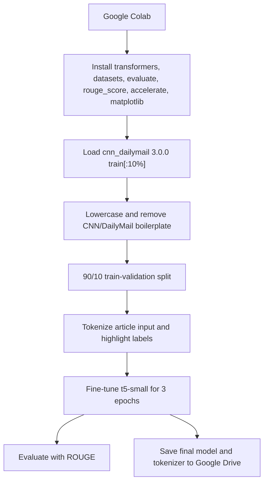

# AI Model

## Model Responsibilities

NewsScribe uses two transformer models:

| Model | Task | Location |
|---|---|---|
| Fine-tuned T5 | Abstractive summarization/headline-style generation | [`backend/model_weights`](../backend/model_weights) |
| DistilBERT SST-2 | Binary sentiment classification | [`backend/sentiment_model`](../backend/sentiment_model) |

## Summarization Training

The training workflow is in [`notebooks/headline_gen.ipynb`](../notebooks/headline_gen.ipynb).



Training parameters from the notebook:

| Parameter | Value |
|---|---|
| Base model | `t5-small` |
| Dataset | `cnn_dailymail`, config `3.0.0` |
| Dataset slice | `train[:10%]` |
| Shuffle seed | `42` |
| Validation split | `10%` of selected data |
| Input max length | `512` |
| Label max length | `64` |
| Learning rate | `2e-5` |
| Train batch size | `8` |
| Eval batch size | `8` |
| Weight decay | `0.01` |
| Epochs | `3` |
| Precision | `fp16=True` |
| Metric | ROUGE |

## Training Data

CNN/DailyMail contains news articles and human-written highlights. The notebook uses the article as input and highlights as target labels.

Cleaning function:

| Cleaning Step | Reason |
|---|---|
| Lowercase text | Reduces casing variation. |
| Remove leading `(CNN) --` style bylines | Prevents boilerplate from dominating summaries. |
| Remove `(daily mail)` marker | Removes source noise. |
| Collapse whitespace | Produces cleaner tokenization. |

## Inference Pipeline

Inference is implemented in `run_pipeline_inference` in [`backend/main.py`](../backend/main.py).

| Stage | Detail |
|---|---|
| Sentiment input | First 384 characters of raw text. |
| Sentiment max length | 384 tokens. |
| Summary input | `"summarize: " + raw_text`. |
| Summary max length | 320 tokens. |
| Decoding | Greedy decoding (`num_beams=1`). |
| Output length | 20 to 70 new tokens. |
| Repetition control | `no_repeat_ngram_size=3`. |

## Model Artifacts

T5 model files:

| File | Role |
|---|---|
| `config.json` | Architecture/config metadata. |
| `generation_config.json` | Default generation settings from checkpoint. |
| `model.safetensors` | Model weights. |
| `tokenizer.json` | Tokenizer data. |
| `tokenizer_config.json` | Tokenizer configuration. |
| `training_args.bin` | Serialized training arguments. |

Sentiment files:

| File | Role |
|---|---|
| `config.json` | DistilBERT sequence classification config. |
| `model.safetensors` | Sentiment model weights. |
| `tokenizer.json` | Tokenizer data. |
| `tokenizer_config.json` | Tokenizer configuration. |

## Evaluation

The notebook computes ROUGE metrics during validation. ROUGE is useful because CNN/DailyMail has reference highlights, but it does not prove factual correctness. A generated summary can overlap the reference while still omitting important context or making unsupported claims.

Recommended future evaluation:

| Evaluation | Purpose |
|---|---|
| ROUGE on held-out CNN/DailyMail | Regression signal against training task. |
| Human review on live URLs | Checks usefulness and faithfulness. |
| Factual consistency metric | Detects hallucinated entities/numbers. |
| Latency percentile tracking | Ensures production usability. |
| Extraction quality scoring | Separates scraper failures from model failures. |

## Prompting

The project uses T5's task prefix:

```text
summarize: <article text>
```

This matters because T5 was pretrained and fine-tuned around text-to-text task prefixes. The notebook and backend both use the same prefix, which keeps training/inference behavior aligned.

## Limitations

| Limitation | Why It Happens |
|---|---|
| Long article truncation | Backend caps T5 input at 320 tokens and URL extracted text at 4000 characters before tokenization. |
| Possible hallucination | Abstractive models generate new text rather than only copying source sentences. |
| News-domain bias | CNN/DailyMail style may not match all publications or regions. |
| Sentiment oversimplification | SST-2 only returns positive/negative labels. |
| CPU latency | Transformer generation is compute-heavy without GPU acceleration. |

## Deployment of Models

The Docker image does not copy model files. Production deployment mounts:

```bash
-v /home/ubuntu/model_weights:/app/model_weights
-v /home/ubuntu/sentiment_model:/app/sentiment_model
```

This keeps images smaller and makes model replacement possible without rebuilding Python dependencies, but it means the host must already contain compatible model files.

