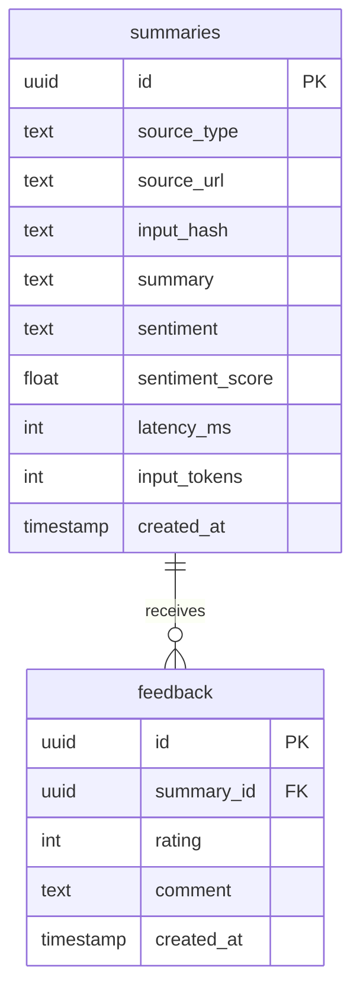

# Database

## Current State

NewsScribe currently has no database. There are no schema files, migrations, ORM models, SQL queries, indexes, or persistent storage layers in the repository.

This is an explicit architectural fact from the file inventory:

| Expected Database Artifact | Present? |
|---|---|
| SQL migrations | No |
| Prisma/Drizzle/SQLAlchemy models | No |
| SQLite database | No |
| Postgres configuration | No |
| MongoDB configuration | No |
| Redis cache | No |
| Backend repository layer | No |

## Why No Database Is Reasonable for the MVP

The current product flow is stateless:

1. User submits text or URL.
2. Backend extracts/summarizes.
3. Backend returns JSON.
4. Frontend displays result.
5. Optional PDF is generated locally in the browser.

No current feature requires persistence. There are no users, saved summaries, billing records, feedback labels, or admin dashboards.

## What Data Exists Only in Memory

| Data | Lifetime |
|---|---|
| Frontend textarea input | Until browser state changes or page reloads. |
| Backend request body | During a single HTTP request. |
| Extracted article text | During `/scrape` request processing. |
| Model outputs | Returned in response; not stored. |
| Frontend result object | Until next request or page reload. |

## Future Schema If Persistence Is Added

If Future Me adds persistence, a minimal relational schema could look like this:

Potential indexes:

| Index | Reason |
|---|---|
| `summaries(input_hash)` | Cache repeated article text/URL outputs. |
| `summaries(created_at)` | Dashboard and cleanup queries. |
| `summaries(source_url)` | Look up previous summaries for the same URL. |
| `feedback(summary_id)` | Join feedback to generated summaries. |

## Database Tradeoffs

| Option | Pros | Cons |
|---|---|---|
| Continue no database | Simple, low maintenance, privacy-preserving by default. | No history, analytics, caching, or feedback loop. |
| SQLite | Easy local persistence. | Not ideal for multi-instance production writes. |
| Postgres | Strong relational model, indexing, production maturity. | Requires hosting, migrations, backups. |
| MongoDB | Flexible document shape. | Less useful if relationships and analytics become important. |
| Redis | Great cache/queue companion. | Not durable primary storage by default. |

## Recommendation

Do not add a database until a feature demands it. The first durable feature should probably be feedback or cached URL summaries. At that point, Postgres plus a migration tool would be the cleanest default because generated summaries have structured metadata and likely future relationships.

