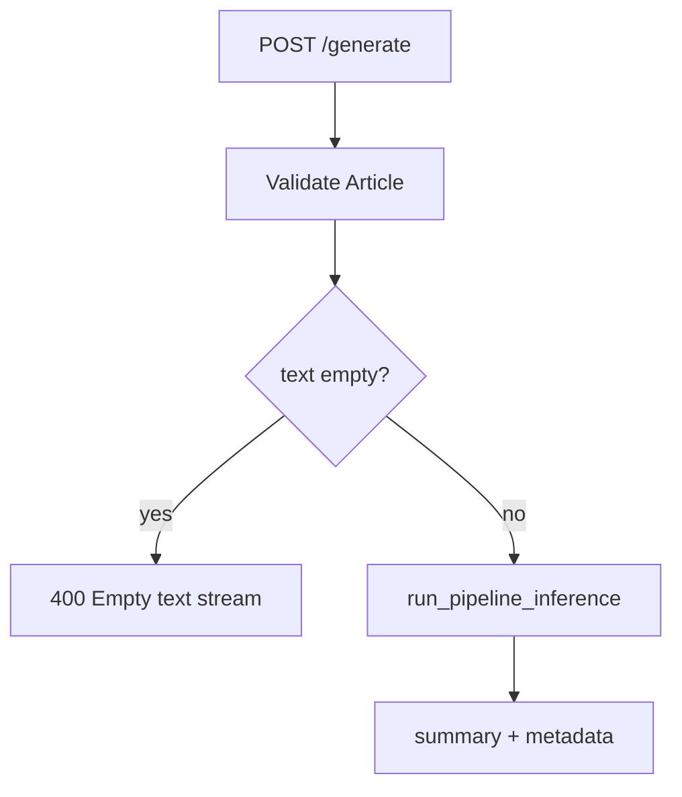
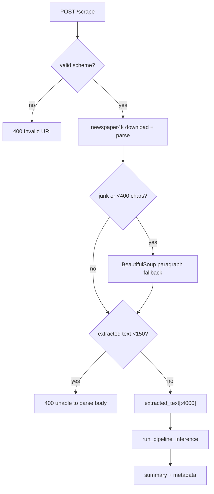

# APIs

## API Summary

All backend endpoints are defined in [`backend/main.py`](../backend/main.py).

| Method | Path | Purpose |
|---|---|---|
| GET | `/` | Health check. |
| POST | `/generate` | Summarize pasted text. |
| POST | `/scrape` | Scrape a URL, extract article text, summarize it. |

## GET `/`

### Purpose

Confirms that the FastAPI process is running.

### Request

No body.

### Response

```json
{
  "status": "healthy"
}
```

### Error Handling

No explicit error handling. If the process is alive and routing works, this should return 200.

## POST `/generate`

### Purpose

Generate a summary and sentiment metadata from direct article text.

### Request Body

```json
{
  "text": "Long article text..."
}
```

### Validation

| Validation | Failure |
|---|---|
| Body must match `Article` model | FastAPI/Pydantic validation error. |
| `text.strip()` must not be empty | HTTP 400 `Empty text stream.` |

### Flow



### Successful Response Shape

```json
{
  "summary": "Generated summary text.",
  "metadata": {
    "latency_ms": 1234.56,
    "input_tokens": 320,
    "device": "cpu",
    "sentiment": "POSITIVE",
    "score": 0.9876
  }
}
```

## POST `/scrape`

### Purpose

Extract text from a news URL and send that extracted text through the same inference pipeline used by `/generate`.

### Request Body

```json
{
  "url": "https://example.com/news/story"
}
```

### Validation

| Validation | Failure |
|---|---|
| Body must match `ScrapeRequest` model | FastAPI/Pydantic validation error. |
| URL must start with `http://` or `https://` | HTTP 400 `Invalid URI.` |
| Final extracted text must be at least 150 characters | HTTP 400 `Unable to safely parse main news body from this layout.` |

### Flow



### Successful Response Shape

Same as `/generate`.

### Error Handling

The route catches all exceptions and converts them into HTTP 500:

```json
{
  "detail": "exception message"
}
```

This is useful during early debugging but should be refined for production because raw exception messages can expose implementation details.

## Frontend API Client Behavior

The frontend in [`frontend/src/App.jsx`](../frontend/src/App.jsx):

1. Builds the base URL from `VITE_API_URL` or fallback `http://127.0.0.1:8001`.
2. Chooses `/scrape` if text starts with `http://` or `https://`.
3. Chooses `/generate` otherwise.
4. Sends JSON with `Content-Type: application/json`.
5. Parses JSON response even for non-2xx statuses.
6. Throws an `Error` using `data.detail` when available.
7. Displays the error in the UI.

## API Improvement Roadmap

| Improvement | Reason |
|---|---|
| Add explicit response models | Makes OpenAPI docs and clients more reliable. |
| Add request length limits | Prevents huge bodies from causing memory/latency problems. |
| Add structured error codes | Frontend can distinguish scrape failure from model failure. |
| Add `/version` or `/metadata` | Helps debug deployed model/runtime versions. |
| Add `/health/ready` | Confirms models are loaded, not just process alive. |

