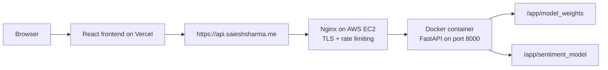
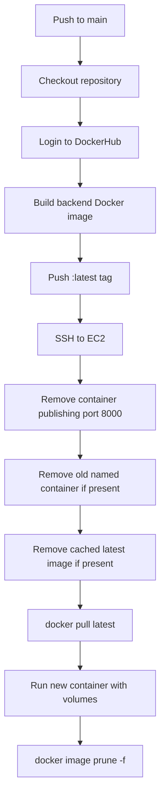

# Deployment

## Production Shape

The README describes this production architecture:



## Backend Docker Image

[`backend/Dockerfile`](../backend/Dockerfile) builds the backend image.

Key steps:

| Step | Purpose |
|---|---|
| `FROM python:3.11-slim` | Small Python base image. |
| `WORKDIR /app` | Fixed application directory. |
| Install `build-essential` and `libstdc++6` | Supports native dependencies such as SentencePiece. |
| Copy and install `requirements.txt` | Installs FastAPI, Transformers, PyTorch CPU, scraping dependencies. |
| Download NLTK `punkt` and `punkt_tab` | Avoids runtime downloader dependency. |
| Copy `main.py` | Adds application code. |
| Expose `8000` | Documents service port. |
| Run Uvicorn | Starts API server. |

## Model Volumes

The production deployment does not bake model files into the image. [`deploy.yml`](../.github/workflows/deploy.yml) runs:

```bash
docker run -d \
  --name newsscribe-backend-inst \
  -p 8000:8000 \
  -v /home/ubuntu/model_weights:/app/model_weights \
  -v /home/ubuntu/sentiment_model:/app/sentiment_model \
  --restart unless-stopped \
  $DOCKER_USER/newsscribe-backend:latest
```

This means:

| Benefit | Cost |
|---|---|
| Smaller Docker image. | EC2 host must be pre-provisioned with model directories. |
| Faster image push/pull. | Model version is not tracked by image tag. |
| Model files can be replaced independently. | Backend can break if mounted files are incompatible. |

## CI/CD Workflow

The deployment workflow triggers on pushes to `main` when backend or workflow files change:

```yaml
on:
  push:
    branches: [ main ]
    paths:
      - 'backend/**'
      - '.github/workflows/**'
```

Pipeline stages:



## Secrets

The workflow expects these GitHub secrets:

| Secret | Purpose |
|---|---|
| `DOCKERHUB_USERNAME` | DockerHub namespace and login username. |
| `DOCKERHUB_TOKEN` | DockerHub authentication token. |
| `AWS_HOST` | EC2 host address. |
| `AWS_PRIVATE_KEY` | SSH private key for `ubuntu` user. |

## Nginx and HTTPS

The README says Nginx:

| Responsibility | Detail |
|---|---|
| TLS termination | Public HTTPS on port 443. |
| Reverse proxy | Forwards to `http://127.0.0.1:8000`. |
| Rate limiting | `5r/s` with burst `10 nodelay`. |
| CORS/mixed content mitigation | Browser talks to a secure API origin. |

The actual `nginx.conf` is not present in the repository, so exact server blocks must be recovered from the EC2 host or recreated from README notes.

## Rollback

Current rollback story is manual. Because deployment uses `latest`, the easiest rollback requires either:

1. Rebuilding and pushing an older commit as `latest`, then rerunning deploy.
2. Manually running a previous image if it still exists on the host or DockerHub.

Future improvement:

| Improvement | Reason |
|---|---|
| Tag image with commit SHA | Allows precise rollback. |
| Keep previous container until health check passes | Avoids replacing working service with broken service. |
| Add `/health/ready` | Confirms model files load. |
| Avoid immediate image prune before rollback window | Keeps last known good image nearby. |

## Local Deployment Commands

Backend:

```bash
cd backend
docker build -t newsscribe-backend .
docker run -d --name newsscribe-backend --restart unless-stopped -p 8000:8000 newsscribe-backend
```

Frontend:

```bash
cd frontend
npm install
npm run dev
```

