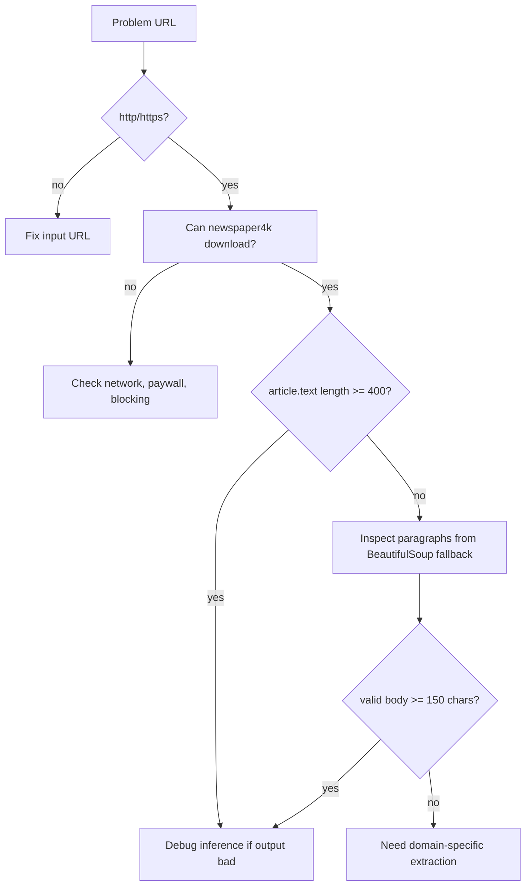

# Debugging

## Debugging Mindset

NewsScribe has four failure zones:

1. Frontend input/API call/rendering.
2. Backend request validation and route logic.
3. Scraping and article extraction.
4. Model loading and inference.

Debug from the outside inward: browser error, API response, backend logs, model files, then deployment/proxy.

## Common Failures

| Symptom | Likely Root Cause | Where to Look |
|---|---|---|
| Frontend cannot reach API | Wrong `VITE_API_URL`, backend down, CORS/proxy issue | [`frontend/src/App.jsx`](../frontend/src/App.jsx), Nginx, backend logs |
| `Invalid URI.` | URL does not start with `http://` or `https://` | `/scrape` validation in [`backend/main.py`](../backend/main.py) |
| `Unable to safely parse main news body...` | Scraper extracted too little text | `/scrape` fallback logic |
| Backend fails at startup | Missing model files, incompatible tokenizer/model, missing NLTK data | Docker logs and model directories |
| Slow response | CPU inference, large article, scraping timeout | `latency_ms`, EC2 CPU usage |
| Sentiment seems wrong | SST-2 binary classifier mismatch with news tone | Sentiment model limitation |
| PDF has odd characters | Source file contains mojibake/encoding artifacts | [`frontend/src/App.jsx`](../frontend/src/App.jsx), [`package.json`](../frontend/package.json) |

## Useful Commands

Backend local:

```bash
cd backend
uvicorn main:app --reload
```

Health check:

```bash
curl http://127.0.0.1:8000/
```

Generate request:

```bash
curl -X POST http://127.0.0.1:8000/generate \
  -H "Content-Type: application/json" \
  -d "{\"text\":\"A long article body goes here.\"}"
```

Scrape request:

```bash
curl -X POST http://127.0.0.1:8000/scrape \
  -H "Content-Type: application/json" \
  -d "{\"url\":\"https://example.com/news/story\"}"
```

Docker logs:

```bash
docker logs newsscribe-backend-inst --tail 100
```

Running containers:

```bash
docker ps
```

Check model volume files on EC2:

```bash
ls -lh /home/ubuntu/model_weights
ls -lh /home/ubuntu/sentiment_model
```

## Backend Startup Checklist

| Check | Expected |
|---|---|
| `/app/model_weights/model.safetensors` exists | T5 weights can load. |
| `/app/model_weights/config.json` exists | T5 architecture can load. |
| `/app/sentiment_model/model.safetensors` exists | Sentiment model can load. |
| `/app/nltk_data` contains `punkt` and `punkt_tab` | Scraping dependencies avoid runtime downloads. |
| Port 8000 is free or old container removed | New container can bind port. |

## Scraping Debug Flow



## Inference Debug Flow

| Question | Why It Matters |
|---|---|
| Did model load at process startup? | Failures happen before any route responds. |
| What is `input_tokens`? | Shows how much text survived tokenization/truncation. |
| What is `latency_ms`? | Separates model slowness from frontend issues. |
| Is input article clean? | Bad extraction creates bad summaries. |
| Are generation settings too restrictive? | `max_new_tokens=70` and greedy decoding favor speed. |

## GitHub Actions Debugging

Check:

| Stage | Possible Failure |
|---|---|
| DockerHub login | Bad username/token secret. |
| Build image | Dependency install failure or Dockerfile issue. |
| SSH action | Bad host/key/security group. |
| Remove old container | Docker daemon permissions or stale state. |
| Run new container | Missing volumes or port conflict. |

The deploy script already attempts to handle:

| Issue | Handling |
|---|---|
| Unknown container publishing port 8000 | Finds and removes it. |
| Existing `newsscribe-backend-inst` | Removes it if present. |
| Cached latest image | Removes it if present. |
| Stale images | Runs `docker image prune -f`. |

