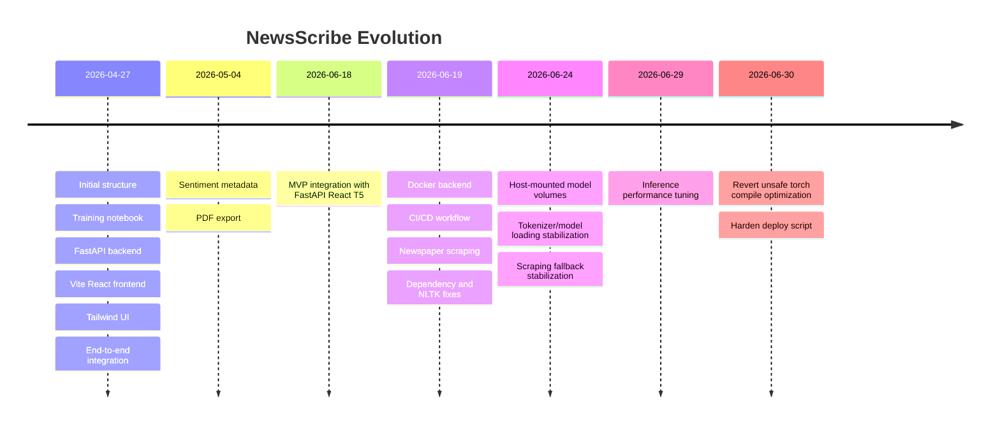

# Project Timeline

This timeline is reconstructed from `git log --reverse --date=short --pretty=format:'%ad %h %s'`.

## Timeline Summary

## Milestones

| Date | Commit | Milestone |
|---|---|---|
| 2026-04-27 | `92ad15d` | Initial project structure and gitignore. |
| 2026-04-27 | `4195f64` | Added model training notebook using 10% CNN/DailyMail split. |
| 2026-04-27 | `7fa6807` | Set up FastAPI backend structure. |
| 2026-04-27 | `6818e10` | Initialized Vite/React frontend. |
| 2026-04-27 | `a3f68f2` | Added Tailwind v4 and mock inference. |
| 2026-04-27 | `b123e50` | Completed end-to-end Scribe UI/backend integration. |
| 2026-05-04 | `8288e52` | Added sentiment in metadata footer. |
| 2026-05-04 | `e533934` | Added PDF export. |
| 2026-06-18 | `b333a79` | Completed MVP with FastAPI, React, and T5 integration. |
| 2026-06-19 | `d6e104c` | Dockerized backend and optimized deployment. |
| 2026-06-19 | `8f43e6a` | Set up automated Docker continuous deployment with link scraping. |
| 2026-06-19 | `44ead2d` | Swapped backend parser to `newspaper4k`. |
| 2026-06-19 | `2e8884e` | Shipped stabilized production engine with Transformers and NLTK configuration. |
| 2026-06-24 | `e1ff9be` | Implemented host-mounted model volume architecture. |
| 2026-06-24 | `c49d648` | Final production architecture stabilization. |
| 2026-06-24 | `fcfc089` | Stabilized semantic scraping layout fallback layer. |
| 2026-06-29 | `451e801` | Removed beam search and enabled KV caching for faster inference. |
| 2026-06-29 | `7656efb` | Pinned PyTorch thread concurrency limits. |
| 2026-06-30 | `0124ad0` | Reverted native torch compilation graph optimization. |
| 2026-06-30 | `00c5f9a` | Hardened deploy script against conditional stderr noise. |

## Architecture Evolution

| Phase | Architecture |
|---|---|
| Prototype | Training notebook plus early backend/frontend skeleton. |
| UI MVP | Single-page React app with Tailwind, loading state, metadata, and export. |
| ML Integration | FastAPI loads local T5 and sentiment models. |
| Scraping Expansion | URL support added through `newspaper4k`, then BeautifulSoup fallback. |
| Productionization | Docker backend, Nginx proxy, GitHub Actions deployment, DockerHub image. |
| Model Artifact Strategy | Large model files moved to host-mounted volumes. |
| Performance Tuning | Greedy decoding, shorter input windows, KV cache, CPU thread limits. |

## Feature Evolution

| Feature | Evolution |
|---|---|
| Input | From text summarization to text-or-URL detection. |
| Output | From summary only to summary plus metadata and PDF export. |
| Scraping | From no URL extraction to `newspaper4k` plus fallback. |
| Deployment | From local commands to Docker image and GitHub Actions EC2 swap. |
| AI | From training notebook to local production model weights. |

